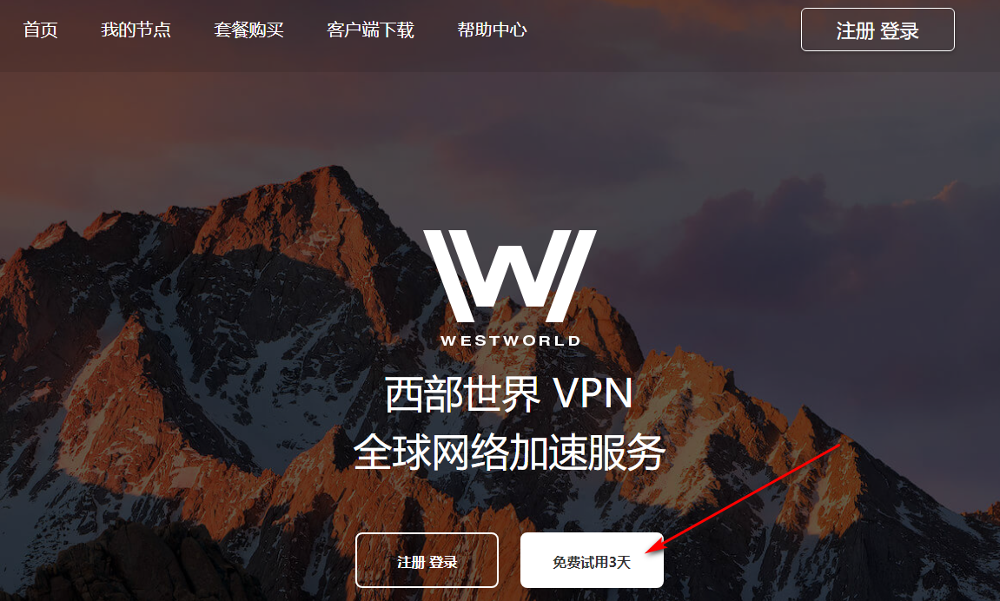
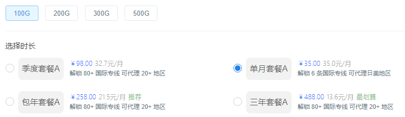

# [解药测评]永久免费科学上网梯子VPN推荐，适用手机电脑和平板，高速稳定系好安全带

### 前段时间，解药一直在找一款稳定且科学上网速度快的梯子VPN，因为最近迷上了看Netflix，里面的片源基本都是比1080P更加高清的4K，所以对梯子的速度和网络稳定性有很高要求，免费的梯子是做不到的，而付费梯子这么多，肯定是要找个性价比高的用。

经过一段时间的寻找，混迹各种电报群，咨询朋友，上网查资料后，锁定了五款运营时间足够久，品牌口碑也好，同时在不高的价格基础上，线路节点和地区配置比较科学完善的梯子，然后又通过逐一免费试用，不断借助Speedtest，Youtube等测速平台测速，最终选择了一款在我看来是高性价比的**电脑手机两用梯子工具**。

就是Westworld梯子VPN加速器，中文名字叫西部世界。

这款梯子工具在我看来足够满足生活中的任何使用场景，不管是上网搜索资料，追剧，打外服游戏加速，做外贸，它的流畅速度和稳定性，都足够使用。

### Westworld官网地址：[https://xbsj4621.fun/i/art005](https://xbsj4621.fun/i/art005)

登录官网，点击【免费试用3天】，就能进入注册界面。

注册方式就不详述了，就是正常的注册流程，值得一提的是，西部世界在注册过程中所使用的邮箱，可以填写真实在用的邮箱，也可以虚构一个不存在的邮箱，都不影响注册成功。

注册成功后，可以进入足足三天的免费试用阶段，后台对免费用户提供了三条免费V2ray节点和三条免费Trojan节点，虽然是免费的，但Speedtest和Youtube测速下来的结果，都非常理想，可以说比很多付费机场梯子的节点速度都要快。而且三天的免费试用时间也足够摸清其性能，再决定是否要进一步解锁付费服务，付费节点的速度能更上一层楼。

付费节点也分为多种套餐，按照流量来划分套餐价格，流量规则划分为每月100G，200G，300G和500G四个规格，可以按照包月，包季度，包年等形式，分别去选购流量套餐。

按照我个人半年使用下来的经验看，每个月100G的流量，已经足够大部分人使用。就算天天刷油管看视频，也够了。除非一天到晚连续在刷视频的重度用户，每个月200G我个人感觉肯定也是足够，如果有下载或者其他大流量需求，可以考虑300G和500G两个规格。

### 高速稳定科学上网VPN梯子流量套餐价格：

**100G：**

包月：这个就是按次付费，每次购买之后，会有100G的流量到账户，能使用6条国际专线，支持多台设备同时使用（可以合租），价格是35/月，如果抢到官方不定时发放的优惠券，可以到25/月。

包季度：一次性连包三个月，价格上更加优惠，每个月会有100G流量，可以解锁80多条国际专线，98/季度。

包年：一次性连包十二个月，每个月会有100G流量，可以解锁80多条国际专线，258/年。

包三年：一次性连包三十六个月，每个月会有100G流量，可以解锁80多条国际专线，488/三年。

这个高速稳定的付费梯子软件，性价比其实非常高的，虽然有些小机场一个月价格可能就十几块，但抛开节点线路质量和品牌口碑谈价格就是耍流氓，西部世界这款梯子软件，所有节点都采用高端IEPL专线，光是这类型的节点线路，性价比已经是提到了很高的高度，这类节点上网速度有多快，真的只有体验过才有发言权。

选购套餐的时候，后台支付方式也多样化，可以选择适合自己的方式。

目前西部世界梯子开发了覆盖各平台的客户端，只要点击【客户端下载】选项，就能下载windows电脑，ios手机，安卓手机，平板iPad等各类系统的客户端。下载一键安装后，登录账号就能连接使用。

### 这款梯子VPN软件使用体验如何？

就如我前面所说，混迹各类电报群，咨询朋友，搜集资料才锁定了五款口碑不错的梯子工具.最终从那五款当中选择了西部世界，不敢说这是最好用的梯子软件，但至少在我能力和目光所能触达的范围内，这个应该是我能找到的最高性价比科学上网梯子软件了.不管是用来做外贸，做Facebook运营，观看Youtube（油管）视频，还是上推特P站等等，足以拥有流畅不卡顿的使用体验，更别提上Google（谷歌）查找资料之类的.而且和其他梯子软件不同，Westworld还有外服游戏加速节点，我顺手打过几把游戏，速度非常好，延迟也很低，可以作为梯子加速器使用。

### 这款翻墙梯子的安全性如何？

我为此特意调查过其背景，它的公司总部位于北美，是当地的团队在运营，并且采取了无日志运营策略，不会记录用户的使用记录。加密技术也很完善，可以有效防止用户IP隐私泄漏。而且这个梯子软件在注册阶段，完全支持使用虚构的邮箱账号注册，购买会员的时候，有一个支付渠道是支持加密货币的，所以完全不用担心安全性问题。

### 这个科学上网梯子能够访问哪些网站？

除去Youtube，Facebook，推特，P站，Google等翻墙后会高频访问的网站之外，还能够访问其他被屏蔽的网站。

### 这个稳定靠谱的翻墙梯子工具会不会跑路？

其实我个人寻找梯子软件的时候，一般会在网上疯狂翻找资料，寻找其最初出现的痕迹。如果是一片空白，近两个月才突然出现的梯子工具，我一般是不会去用的。虽然不一定每个都是套壳或者是脚本小子开发的，但总得给它时间经过市场的检验。西部世界网络上最早出现的痕迹是在2019年，至少有两年多的运营历史了，相对来说这是一个比较可靠的安全线。之前我也陆续使用过一些免费梯子，无一例外都是用了一段时间后，出现各种问题，要么断连接，要么登录不上，西部世界这款梯子软件，我使用至今，没有出现任何问题。

### 这款付费梯子的速度如何？

梯子软件的速度往往会被本地网络环境影响，不过目前最普遍的应该都是100M宽带，我自己也是100M的，我通过Speedtest测速，西部世界这款梯子软件基本能将本地网速给拉满，而且看Youtube视频，清晰度会默认1080P.之前我说过，我找速度快的梯子是为了看Netflix的4K超高清视频的，经过使用下来，4K视频播放也完全没有压力，可以做到超前缓冲，速度这块儿不存在任何问题。

其实现在的生活当中，免不了要借助梯子软件去外网搜集各种资料，获取信息的渠道对于当下工作而言非常重要，无论是开发网站写代码，还是学习金融知识又或者仅仅是查找论文参考文献发邮件，一个稳定好用的科学上网梯子都是至关重要的。
